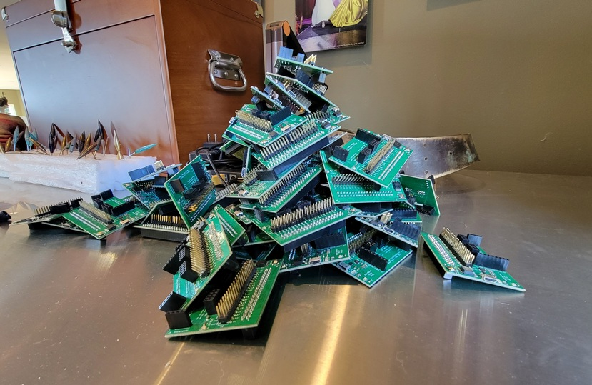
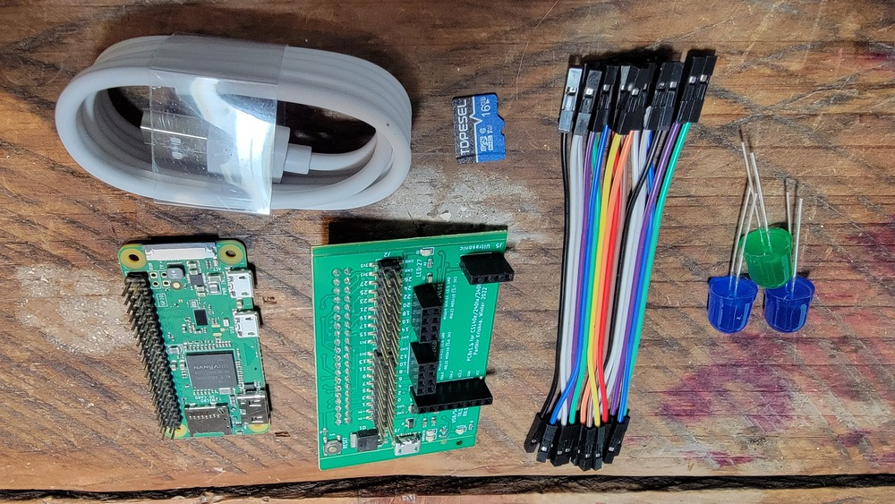
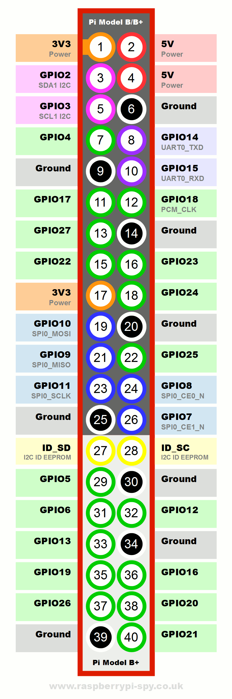
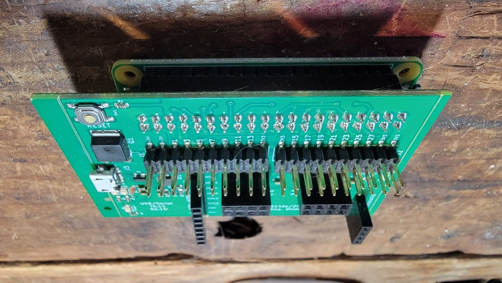
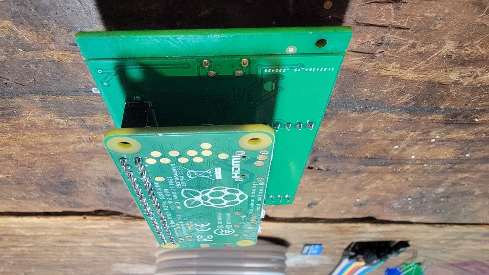
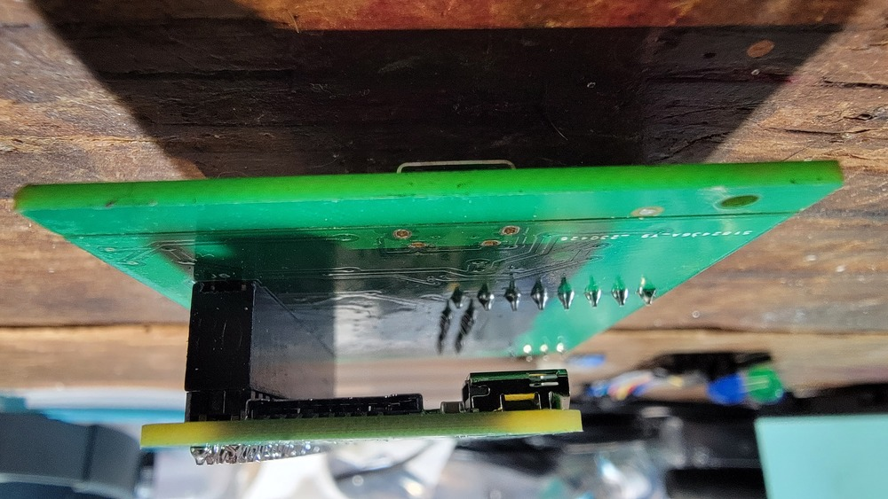

## Setup r/pi hardware and its toolchain

  

Checkoff:
  - Running `make` in `4-checkoff` should compile and run a hello-world
    program on your pi along with some other tests.

This lab gives the steps to setting up and making sure the 
your r/pi (Model 1 A+ or Model Zero) and ARM toolchain works.
 - [HINTS file](HINTS.md) lists solutions to common problems people
   run into.

 - This writeup assumes the use of Parthiv's breakout board rather than
   a standalone tty-usb device --- If you use the latter, the 2023 140E
   writeup explains how to do so.

There's a lot of fiddly little details in getting a pi working, and this
lab is many people's first time working with hardware, so we break the
lab down into many (perhaps too-many) small steps.

Note: you obviously have to do your own work, but please help others
if they get stuck or if you figure out something. This is the kind of
class where talking over things will make everything a lot clearer,
and where having multiple people debug an issue is an order of magnitude
more effective than working alone. If you think of a way of explaining
something that's clearer than the documentation or the README, post it
in the newsgroup so others can benefit from your insight!

### tl;dr all the steps

Whenever you setup a new pi or you want to skip all the explanation
below, you'll do the following.  (The rest of the README gives more
details).

*Setting up a new pi*:

1. Setup microSD: Copy all the firmware to the new SD card.
   The `firmware` directory is at the top level of the class repo
   (`cs140e-24win/firmware`):

        % cp firmware/* /path-to-sd-card
        % sync

2. Setup pi: Plug microSD, cable, and parthiv-pi into the pi.
3. With pi connected to laptop, check that the hardware works by running
  `hello.bin`:

        % pi-install firmware/hello.bin
        BOOT:simple_boot: sending 1404 bytes, crc32=a555db78
        BOOT:waiting for a start
        BOOT:bootloader: Done.
        hello world from the pi
        DONE!!!

*One time class configuration*:

1. Bootloader: Add `~/bin` to your `PATH`.  Copy the bootloader (either
  `pi-instal.linux` or `pi-install.macos`) to `~/bin`.  Rehash your
   shell and running `pi-install` with no pi-program from any directory
   should give an error:

        % pi-install
        no pi program
        ...

2. Setup the `CS140E_2024_PATH` environment variable to the location of 
   the class repo.  `make` in `checkoff` should succeed.

If that worked, you're good to go!  If not see the [HINTS](./HINTS.md)
file for debugging tips.

### Crucial: Life and death rules for pi hardware.

  

*Before doing anything: always obey the first rule of PI-CLUB*:

- **_IF YOUR PI GETS HOT TO THE TOUCH: UNPLUG IT_**
- **_IF YOUR PI GETS HOT TO THE TOUCH: UNPLUG IT_**
- **_IF YOUR PI GETS HOT TO THE TOUCH: UNPLUG IT_**
- **_IF YOUR PI GETS HOT TO THE TOUCH: UNPLUG IT_**
- **_IF YOUR PI GETS HOT TO THE TOUCH: UNPLUG IT_**

This rule generalizes: If *anything* ever gets hot, or smells burnt
**_DISCONNECT_**!  Sometimes devices have manufacturing errors (welcome
to hardware), sometimes you've made a mistake.  Any of these can lead
to frying the device or, in the worst case, your laptop. So don't assume
you have a safety net: it's up to you to avert disaster.

In addition:

1. Whenever you make a hardware change --- messing with wires,
   pulling the SD card in/out --- **_make sure pi is disconnected
   from your laptop_**. It's too easy to short something and fry
   your hardware. Also, pulling the SD card out while under power
   sometimes causes corruption when some bytes have been written out
   by your laptop and others have not.

2. While the pi has its own unique features, it's also like all other
   computers you've worked with: if it's not responding, "reboot"
   and retry by unplugging it (to remove power) and reconnect.

3. You'll notice there is metal sticking out on the bottom of the pi where
   pins have been soldered.  You can touch this with your skin without
   issue.  However, don't rest the pi directly on a metal surface or it
   can short-circuit and fry the board.

   In particular, it *appears* that some mac's chasis are conductive,
   so you probably shouldn't rest your pi on it directly.  (We lost 8
   boards the first lab last year, with the common variable that all
   students had mac's.)  If you work on a copper or metal table, don't
   place the pi flat on it either.

-------------------------------------------------------------------
## 0. Make sure you have everything.

  

You should have the pictured parts:

1. A r/pi zero. The pi provides multiple ground pins and both 5v and
   3.3v outputs.  The GPIO pins themselves put out 3.3v.
2. a microSD card;
3. Parthiv's breakout board `parthiv-pi`.  (As mentioned in class,
   Parthiv designed this board as his 240lx final project: if you take
   this follow on class he has a set of labs on how to fab your own pcb.)
4. a few of LEDs
5. a bunch of female-female jumpers.

Parthiv's board has a bunch of nice features:
 1. There is a small metal button to reset power vs having to unplug
    a USB cable.
 2. It plugs directly into the pi using a solid header
    rather than using jumper wires, which are both messy and can easily
    be too-loose or come loose while visually looking fine.
 3. It reorganizes the pi GPIO pins sequentially and labels them.
 4. It has two headers for NRF RF transcievers (used later in the quarter)
    along with an I2S mic and a sonar device.

If you want to use the pi on its own,
you can see the raw pi GPIO pin layout in:
<table><tr><td>
  
</td></tr></table>
Where the pi is oriented with the two rows of pins on the right of the board.

--------------------------------------------------------------------
### 1. Setup your SD card

In order to run code on the pi, you will need to be able to write to a
micro-SD card on your laptop.

The SD card holds both files used by the pi hardware to boot up, as
well as a program (which we somewhat inaccurately call a "bootloader")
that spins in a loop, waiting for your laptop to send a program over the
UART-TTL using `pi-install`.  If the pi-side bootloader successfully
receives a program successfully from the unix-side, it copies it into
pi memory, and then jumps to it. We currently give you a pre-compiled
version (in `firmware/kernel.img`).  You will write this bootloader code
in the upcoming few labs.

To write the SD card:

1.  Get/bring a micro-SD card reader or adaptor if its not built-in
    to your laptop. 

2.  Plug SD card into your computer and figure out where it's mounted.
    Typically on MacOS it is in `/Volumes` and on linux in
    `/media/yourusername/`, some newer linuxes might put it in
    `/run/media/yourusername/`).

3.  Copy all the files from the `firmware` directory at the top level of 
    the class repo to the SD card. (I.e., at `cs140e-24win/firmware`.)

    You should do the copy from the command line using `cp`, which is
    much much faster and better than using a gui (e.g., you can put it
    in a `Makefile`, or use your shell to redo a command). 

    You'll need to figure out where your SD card is mounted (usually on
    MacOS it is in `/Volumes` and on linux in `/media/yourusername/`,
    some newer linuxes might put it in `/run/media/yourusername/`).

    On my linux laptop my SD card is mounted at `/media/engler/0330-444/`
    (your path will be different!).  So, I could do the following to
    copy the entire contents of the class `firmware` directory:

          % cp ../../firmware/* /media/engler/0330-444/
          % sync  

    The `sync` command forces the OS to flush out all dirty blocks to
    all stable media (SD card, flash drive, etc). At this point you can
    pull the card out.

    Pro tip: **_do not omit either a `sync` or some equivalant file
    manager eject action_** if you do, parts of the copied file(s)
    may in fact not be on the SD card. (Why: writes to stable storage
    are slow, so the OS tends to defer them.)
    
4. Check the contents of the firmware against the sd card to make
   sure things copied:

        % ls ../../firmware
        blink-actled.bin  bootcode.bin	  config.txt  kernel.img
        blink-pin20.bin   bootloader.bin  hello.bin   start.elf
        % ls /media/engler/0330-444
        blink-actled.bin  bootcode.bin	  config.txt  kernel.img
        blink-pin20.bin   bootloader.bin  hello.bin   start.elf

4. If both are identical, eject your card.

Note:
 - when you develop your own remote bootloader (in a few labs) you
   have to use this SD card method repeatedly to load new versions,
   so pay attention to how you do it on your computer!

 - On linux: the SD cards are often shipped with a corrupt FAT32 file
   system. Some versions of Linux seem unable to repair this corruption
   and will mount read-only.  I had to mount it on a windows machine
   and format it.

Ok, now that we have configured SD card, we can setup the hardware.

--------------------------------------------------------------------
### 2.  Make sure hardware is working

Checkoff:
  - you can run `hello.bin`

In the past we've used a smaller set of steps (still up at the 
2023 offering).     This year we cut the time and words by taking
a big jump and then doing differential debugging if this doesn't
work.

Again, before you start:
1. If anything starts heating up, disconnect!  If you have a short
   (where some power source feeds into ground) you'll fry the hardware.

2. If you see or smell smoke, disconnect! Smoke means something has fried,
   and the longer you leave it plugged in the more things will get
   destroyed.

  
   
  

Connect everything:

  1. Plug the SD card into your pi -- you should feel a "click" when
     you push it in.
  2. Plug the usb cable into the parthiv-pi and your laptop.
  3. As shown in the images above: Plug the pi into `parthiv-pi`.

     *NOTE*: as always connecting parts with so many pins, you'll want to
     apply even pressure to both the pi and parthiv-pi when seating them
     together.  If you need to disconnect, pull out evenly by wiggling.

After everything is connected, use the provided staff bootloader
(in `cs140e-24win/bin`) to run the precompiled hello world program
`hello.bin` (there is also a copy of `hello.bin` in the `firmware` directory
for easy locating).

If you're on a mac:

        % ../../bin/pi-install.macos hello.bin

If on linux:

        % ../../bin/pi-install.linux hello.bin

You should see output like:

        BOOT:simple_boot: sending 1404 bytes, crc32=a555db78
        BOOT:waiting for a start
        BOOT:bootloader: Done.
        hello world from the pi
        DONE!!!

If that works, works, great.  You are done with this part.  Otherwise
see the debugging note below.

#### If `pi-install` can't send the program

The most common issue is missing drivers or permissions, so
we try that first, then do differential debugging on the hardware.

##### To fix your laptop.

MACOS: likely issue is you are missing the tty-USB driver.

- Download and install the drivers for a
  CP210x USB-to-UART driver as described in the
  [cs107e docs](https://web.archive.org/web/20210414133806/http://cs107e.github.io/guides/install/mac/).
- Make sure you reboot after doing so! (Go Apple!)

Linux:
- You shouldn't need drivers, however you may need to add yourself to
  the `dialout` group (or `serial`) depending on the distribution.

      sudo adduser <your username> dialout

  If you do this, make sure you login and logout.

  If that still doesn't work, you may have to remove `modemmanager`:

      sudo apt-get remove modemmanager

  In this case you may need to reboot.

##### To diagnose your hardware.

This is an example of a common problem all quarter: your system doesn't
work, and there are a few possible causes.  (The most common is you
don't know if not-work is from hardware or software.)

As in all of these cases, you should get used to immediately doing
differential debugging to narrow down the culprit.

  - Find someone that has working hardware and see if your hardware works on
    their laptop.
  - If your hardware works on their laptop: your laptop is the issue (see above
    for permissions or driver issues first).
  - If your hardware does not work on their laptop: one or more of
    the components is the problem.  You'll a further binary search on
    the components to find the problem.

    Based on probabilities, we suggest first swapping SD cards.
    It's pretty common to not have copied the firmware correctly. (Or
    to have not seated the card.)

    If this doesn't fix it, swap out the pi --- these may have been
    mis-soldered.

    If that doesn't fix it, try the other components.

    If this process does not find the issue: interesting. Let us know! 

In any case, remember this algorithm.  It will save you tons of time in
the future (even outside this class).

  

--------------------------------------------------------------------
### 3.  Put `~/bin` in your `PATH` variable.

This step and the next should only ever need to be done once.  

Checkoff:
  - Run `make` in `3-bin-hello` and see that it compiles and run hello.
  - Alternatively: you should be able to type `pi-install` in any
    directory and have it be found and run.

To save you time, typing and mistakes you'll now tell your shell to
look for executable programs in a `bin` directory located in your home
directory (i.e., `~/bin`) and then copy `pi-install` into it.

We suggest you figure out how to do this on your own, but if you 
get stuck, here's a bit more information:

  1. For whatever shell (`tcsh`, `bash`, etc) you are using, figure
     out how to edit your `PATH` variable so that you can install binary
     programs in a local `~/bin` directory and not have to constantly
     type out the path to them.  E.g.,

           % cd ~          # change to your home dir
           % mkdir bin     # make a bin directory
           % cd bin        # cd into it
           % pwd           # get the absolute path
           /home/engler/bin

     To figure out your shell, you can typically check in `/etc/password`:

           % grep engler /etc/passwd
           engler:x:1000:1000:engler,,,:/home/engler:/usr/bin/tcsh

     Since I use `tcsh`, to add `/home/engler/bin` to my `path` I would
     edit my `~/.tcshrc` file and change:

          set path = ( $path  )

     To:

          set path = ( $path /home/engler/usr/bin )

     and then tell the shell to re-scan the paths as follows:

           % source ~/.tcshrc

     Note, you have to run `source` in every open window:  it may be
     easier to just logout and log back in.

     For MacOS users using `bash`, put the path to your `~/bin` directory
     in a `.bashrc` file in your home directory. Just run:

           % vim ~/.bashrc

     When you add your path, make sure you include you default path or
     you may mess up your terminal.  This looks like:

           export PATH="$PATH:your/path/here:your/other/path/here"

      and source it the same way as the `.tcshrc`.  The instructions for `zsh`
      (the default on some newer Macs) are the same as for `bash`, but edit
      `~/.zshrc` instead.

------------------------------------------------------------------------
## 4. Set your `CS140E_2024_PATH`

Checkoff:
   - Running `make` in the `4-checkoff` directory should compile and run
     a hello world program without complaint.

This is the last, one-time-only configuration you'll have to do. We need
it so `Makefiles` know how to find your class installation.

Similar to how you added your local `~/bin` directory to your shell's path
on the first lab, today you're going to edit your shell configuration file
(e.g., `.tcshrc`, `.bash_profile`, etc) to set an environment variable
`CS140E_2024_PATH` to contain where you have your class repository.

NOTE: 
  - Do not put the class repo in a directory has a space!
    This will break various things with unclear errors.  This happened
    to a few MacOS users.

E.g., for me, since I'm running `tcsh` I edit my `.tcshrc` file and add:

    setenv CS140E_2024_PATH /home/engler/class/cs140e-24win/

To the end of it.  If you use `bash` you'll do an:

    export CS140E_2024_PATH=<path to your repo>

And, as before, don't forget to source your configuration file.

As a simple test:

        % cd checkoff
        % make
        ... bunch of stuff ...
        hello: things worked!
        DONE!!!

If this doesn't work:
  1. You likely didn't source the appropriate shell file (easiest is to just
     logout and log back in).
  2. You mispelled `CS140E_2024_PATH` or gave it the wrong path.

NOTE:
  - Once you set this variable, don't re-install your 140E repo somewhere
    else without updating it!  We had a hard bug last quarter when a
    student did this and didn't delete the old repo (so all makefiles
    used it and ignored updates to the new one).
