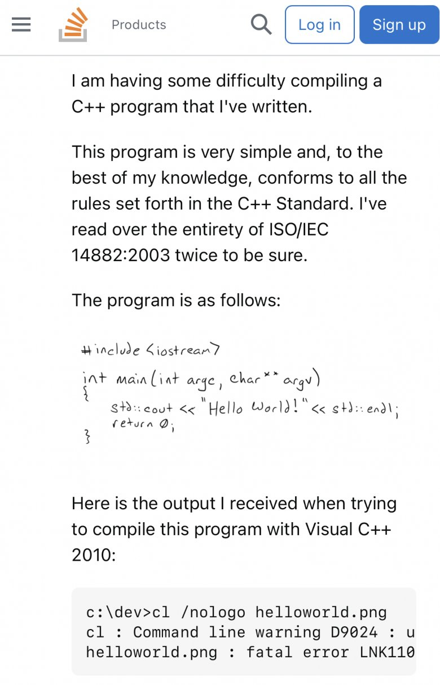

# Compilation lab

Unlike all subsequent labs, our first two don't use hardware.  They should
give a good feel for whether the class works for you without requiring
a hardware investment.

Today's short lab focuses on what happens when you compile code.  How to
see how the compiler translated your C code by examining the machine code
it produced.  And some some of the subtle rules for how the compiler can
do this translation.  What we cover will apply to every lab this quarter.
   - The `docs` directory has useful, further readings.

The next lab will dive into subtle inductive magic tricks that
arise when you compile a compiler using itself.  FWIW: in the past,
this lab was by far the favorite in the class post mortem.

What to do:

  1. Check out the class repository from github and setup the gcc
     cross-compiler.  See below.

  2. Read through the note on 
     [using gcc to figure out assembly code](../../notes/using-gcc-for-asm/README.md) and work through the examples.

     The ability to look at assembly to see how the compiler transformed
     your code (more on this in the next bullet) or to see how to do an
     act in assembly is a skill you'll use all quarter.  Not doing it
     was a pretty common initial mistake we saw last year.

     Many people get stuck really easily when they have to figure out
     how to write assembly code (reasonable since its new).  A simple
     hack to answering "how do I do X in ARM assembly?" is to do X
     in C code, use `gcc` to compile the C code to ARM machine code,
     and look at the result.  Using the compiler with active aggressive
     versus passively sitting and thinking will save you a bunch of time
     (not just in this class.)

  3. Read through the note on observability and compiler optimization:
     [observability](../../notes/observability/README.md) and work
     through the examples in `examples-pointer` and `examples-volatile`
     and then answer a few questions below.

     You should re-read this note carefully outside of class (several
     times!)  The compiler has very strong ideas about when and who
     can observe changes it makes to code.  Hardware devices typically
     wildly violate these assumptions.  Some of the hardest bugs that
     arise in the class (and IRL) come from ignorance of how and why
     these violations cause problems.

  
Checkoff:

  - Sections 2 and 3 below have some questions you should answer and check
    off with a CA.

  - Feel free to work with another person and checkoff as a team, but
    you should both have code written on your own laptops and be able
    to answer each on your own.

  - Simple extension: write some C examples that show the compiler
    doing something interesting / surprising.  E.g., write C code
    that shows off fancy optimizations the compiler does.

-------------------------------------------------------------------
## 1. install the gcc tool chain

### macOS

Use the [cs107e install notes](https://web.archive.org/web/20210414133806/http://cs107e.github.io/guides/install/mac/).
Note: do not install the python stuff. We will use their custom brew formula!

If you get an error that it can't find `string.h`, you want to set `CPATH`
to the empty string (see a TA for help if you need it).

### Linux

For [ubuntu/linux](https://askubuntu.com/questions/1243252/how-to-install-arm-none-eabi-gdb-on-ubuntu-20-04-lts-focal-fossa), ARM recently
changed their method for distributing the tool change. Now you
must manually install. As of this lab, the following works:

        wget https://developer.arm.com/-/media/Files/downloads/gnu-rm/10.3-2021.10/gcc-arm-none-eabi-10.3-2021.10-x86_64-linux.tar.bz2

        sudo tar xjf gcc-arm-none-eabi-10.3-2021.10-x86_64-linux.tar.bz2 -C /usr/opt/

We want to get these binaries on our `$PATH` so we don't have to type the
full path to them every time. There's a fast and messy option, or a slower
and cleaner option.

The fast and messy option is to add symlinks to these in your system `bin`
folder:

        sudo ln -s /usr/opt/gcc-arm-none-eabi-10.3-2021.10/bin/* /usr/bin/

The cleaner option is to add `/usr/opt/gcc-arm-none-eabi-10.3-2021.10/bin` to
your `$PATH` variable in your shell configuration file (e.g., `.zshrc` or
`.bashrc`), save it, and `source` the configuration. When you run:

        arm-none-eabi-gcc
        arm-none-eabi-ar
        arm-none-eabi-objdump

You should not get a "Command not found" error.

If gcc can't find header files, try:

       sudo apt-get install libnewlib-arm-none-eabi

-------------------------------------------------------------------
## 2. Use `gcc` to figure out assembly.

You should answer these questions for checkoff.  In each case: 
write a bit of C code, and be prepared to explain how the machine code
it produces shows your answer is correct.
  1. What register holds a pointer (not integer) return value?
  2. What register holds the third pointer argument to a routine?
  3. If register `r1` holds a memory address (a pointer), 
     what instruction do you use to store an 8-bit integer to that location?
  4. Same as (3) but for load?
  5. Load/store 16-bit?
  6. Load/store 32-bit?
  7. Write some C code that will cause the compiler to emit a `bx`
     instruction that *is not* a function return.
  8. What does an infinite loop look like?  Why?
  9. How do you call a routine whose address is in a register rather
     than a constant?  (You'll use this in the threads lab.)

Finally implement the following routines. (Note: you should cheat by 
using the compiler as above!)

  1. Implement a an assembly routine `unsigned GET32(void *addr)` that
     does a 32-bit load of the memory pointed to by address `addr`
     and returns it.  Put your implementation in a `mem-op.S` assembly
     file and make sure it compiles with your `arm-none-eabi-gcc`.

            # compile but don't link
            % arm-none-eabi-gcc -c mem-op.S
            # disassemble.
            % arm-none-eabi-objdump -d mem-op.o
 
  2. Also implement `GET16` and `GET8`.

  3. Similarly, write an assembly routine 
     `void PUT32(void *addr, unsigned val)` 
     that stores the 32-bit quantity `val` into the memory pointed
     to by address `addr`.  Also put this in `mem-op.S` and make sure
     it compiles.

  4. Also implement `PUT16` and `PUT8`.

-------------------------------------------------------------------
## 3. Observability.

### Questions about example-volatile.

For each of the following: make a copy of the file in question, do
the modification and be able to explain how the machine code shows
you are right:

  1. Give two different fixes for `2-wait.c` and check that they work.
  2. Which of the two files `4-fb.c` and `5-fb.c` (or: both, neither) 
     have a problem?  What is it?  If one does and not the other, why?
     Give a fix.

### Questions about example-pointer.

For all the files, make sure you can answer the questions in comments
using the generated machine code and explain why.

In addition, you should be able to answer the following questions from
a previous 240 exam:

  1.  Which (if any) assignments can the compiler remove from the code
      in this file?
    
            /* foo.c start */
            static int lock = 0, cnt = 0;

            void bar(void);

            void foo(int *p) {              
                cnt++;                      // line 1
                lock = 1;                   // line 2
                bar();                      // line 3
                lock = 0;                   // line 4
                return;                
            }
            /* foo.c end */

   2. The compiler analyzes `foo` in isolation, can it
      reorder or remove any of the following assignments?

            void foo(int *p, int *q) {
                *q = 1;
                *p = 2;
                *q = 3;
                return;
            }

    3. How much of this code can gcc remove?  (Give your intuition!)

            #include <stdlib.h>
            int main(void) {
                int *p = malloc(4);
                *p = 10;
                return 0;
            }

-------------------------------------------------------------------
## Post-script

We did a quick drive by through massive compiler topics.  While real
compilers can seem (and often are) complicated, they also expose
their results fairly easily.  The habit of looking at what they did,
reasoning about why, and figuring out how to answer questions by feeding
them intentionally crafted inputs will serve you well in the class and
future endeavors.

In closing, heh:

  

