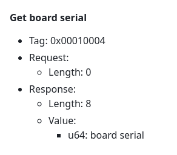
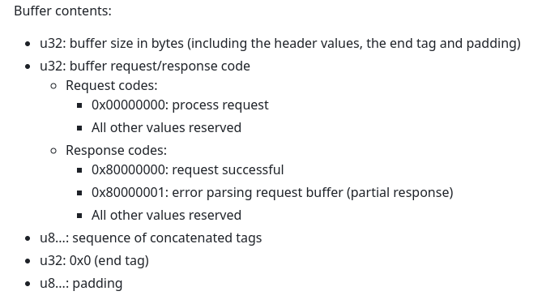

## I2C + mailboxes.

Since this is midterm week, we'll continue our break from tricky execution
code (short, but hard to debug) and continue doing useful but not nearly
as hard to debug device level code.  

Two pieces:
1. The i2c protocol.  You used our staff i2c code on tuesday to
   communicate with your accel/gyro, so it makes sense to write
   it yourself.  The broadcom document pages 28---36 describes it.

   You'll notice that the i2c datasheet looks similar to UART
   (fixed-size FIFO queue for transmit and receive, the need to check
   if data or space is available, control over speed, errata, etc).
   The more devices you do the more you'll notice they share common
   patterns.  The nice thing: there exists an N s.t. after doing N
   devices, doing N+1 is pretty quick.

   The wikipedia for the i2c protocol gives a pretty easy pseudo-code you
   can use to do a bit-banged version.

2. The mailbox interface.  The pi is a bit weird in that the GPU
   controls a lot of the action.  As described at:

    - [mailboxes](https://github.com/raspberrypi/firmware/wiki/Mailbox-property-interface)

   The pi gives a way to send messages to the GPU and receive a response.
   If you look through the interface writeup you'll see all sorts of
   useful facts you can query for --- model number, serial number,
   ethernet address, etc.  So it's worth figuring out how to do it.

   As we expect, the mailbox interface is not super-intuitive,
   and the main writeup uses passive-declarative voice style that makes
   it hard to figure out what to do.  (One key fact: the memory used to
   send the request is re-used for replies.)

    So we'll do a few examples so you can get a handle on it.
    
Checkoff:
  1. i2c hardware driver.  Should drop into last lab and give sensible
     values.  
  2. Mailbox: get your pi's revision, physical memory size and temperature. 
  
Various extension ideas:
  1. SW i2c.  This is useful for banging a bunch of devices. 
  2. Overclock your pi and measure how much faster you can get it before 
     things break down.  Ideally you'd read the temperature and downthrottle
     when things get "too hot" (not sure what that is :).
  3. Drive a bunch of accels at once.
  4. Do loop back where you SW i2c to yourself and see how fast you 
     can make it: use two threads, one for sender, one for receiver,
     and do a cswitch when they are waiting using  delays (the code
     in libpi will call `rpi_wait` that you can just write to call
     `rpi_yield`).

------------------------------------------------------------------------------
### 1. I2C driver: `code-i2c/i2c.c`

***NOTE: three easy mistakes***:
  - Most registers have fields you can just write to clear, but 
    if the register has a device enable flag in it, you better keep 
    this bit set!
  - Printing to debug can mess up i2c and cause a correct driver
    to act incorrectly.  So be careful (I wasted 20 minutes).
  - If the device gets in a bad state you'll have to do a hard 
    power cycle of everything or it will just ignore you.  (You'll
    be able to tell b/c the staff i2c driver won't work either.)

By now you should be able to bang out this driver pretty quickly.
Hints:
  1. We'll use BSC1.  The document states we can't use BSC2.  I haven't
     tried BSC0.
  2. As a first step, try to read known values and make sure the device
     is talking to you.   If you look in the document you'll see that
     on boot-up `cdiv` (p34) should return 0x5dc and `clkt` (p35) should
     return 0x40.  Worth checking them to make sure things are working.
  3. In general: Make sure you have device barriers when setting GPIO and I2C.  
     Along with when we enter and leave the routines.

Initialization: `i2c_init`

  1. You'll need to setup the GPIO SCL and SDA pins (you can see those in 
     `docs/gpio.png`).  
  2. Then enable the BSC we want (C register, p 29) to use along with
     any clock divider (p 34, default is 0).
  3. Clear the BSC status register (S register, p 31):
     clear any errors and clear the done field.
  4. After done: Make sure there is no active transfer (S register, p31)
     and along with a few other fields that make sense (up to you).

Again, make sure you use device barriers.

Reading data: `i2c_read`:
  1. Do the start of a transfer.  

     Before starting: wait until transfer is not active.

     Then: check in status that: fifo is empty, there was no clock
     stretch timeout and there were no errors.  We shouldn't see any of
     these today.

     Clear the DONE field in status since it appears it can still be
     set from a previous invocation.

     Set the device address and length.

     Set the control reg to read and start transfer.

     Wait until the transfer has started.

  2. Read the bytes: you'll have to check that there is a byte available
     each time.

  3. Do the end of a transfer: use status to wait for `DONE` (p32).  Then
     check that TA is 0, and there were no errors.

Write has the same transfer start (step 1) and end (step 3). As with
uart you'll have to wait until there is space and then you write 8 bits
using a `PUT32` (not `PUT8`).

The code:
  1. There is currently just a simple program that reads the device ID.
  2. To run your accel you'll either copy or symlink the code into a subdirectory
     in `code-i2c` or put `mpu6050.c` and `mpu6050.h` into libpi, the driver
     into `code-i2c`, and link against it.

------------------------------------------------------------------------------
### 2. mailboxes `code-mailbox/mailbox.c`

If you look through the (unfortunately incomplete) [mailbox
writeup](https://github.com/raspberrypi/firmware/wiki/Mailbox-property-interface)
you'll see all sorts of useful facts you can query for --- model number,
serial number, ethernet address, etc.  So it's worth figuring out how
to do it.

So that's what we will do.  Some hints:

  1. As always: if you want to write the code completely from scratch,
     I think doing so is a valuable exercise.  However, in the interests
     of time I put some starter code in `code-mailbox/`.  Extend it
     to query for physical memory size along with a couple of other
     things that seem useful.

Rules:
  1. Buffer must be 16-byte aligned (because the low bits are ignored).
  2. The response will overwrite the request, so the size of the buffer
     needs to be the maximum of these (but not the summation).
  3. The document states that additional tags could be returned --- it may
     be worth experimenting with sending a larger buffer and checking
     the result.

##### Example: getting the board serial number

If you read through the mailbox document, there's a bunch of cool little
factoids you can get (and sometimes set).  One is the unique board serial
number. The main useful property of the serial number is uniqueness and
persistence --- no board in this room should have the same serial number
and a given board's serial number does not change.

Later this quarter we'll see how unique, persistent host identifiers
are useful in a networked system when you want to have a guaranteed
unique ID for ordering, statically binding programs to boards, etc.
For the moment, let's just try to figure out what ours are.

Searching through the mailbox document we see the "get serial number"
message is specified as:

  

Where:
  - the "tag" of `0x00010004` is a unique 32-bit constant used 
    to specify the "get serial" request.  This is a message opcode
    to the GPU (the "video control" or VC) knows the request.
  - The request message size is 0 bytes: i.e., we don't send 
    anything besides the tag.
  - The  response message size is 8 bytes holding the serial number.
    (i.e., two 32-bit words). 

Ok, how do we send it?  The start of the document has a somewhat
confusingly described message format.

The first part is fairly clear:

  

For our "get serial" message we'll need a 8 word message (calculated
below) where each word in the message `msg` will be as follows:

  - `msg[0] = 4*8`: The first 32-bit word in the message contains the 
     size of tte message in bytes.   For us: as you'll see the 
     message has 8 words, each word is 4 bytes, so the
     total size is `4*8`.
  - `msg[1] = 0`: the second 32-bit word in the message contains
    the request code, which is always 0.  After the receiver writes
    the reply into the `msg` bytes, `msg[1]` will either change to
    `0x80000000` (success) or `0x80000001` (error).

  - We then fill in the tag message.
     - `msg[2]= 0x00010004` (our tag: specified by the doc).
     - `msg[3] = 8`: the response size in bytes: the serial
       is two 32-bit words so this is 8 bytes.
     - `msg[4] = 0`: the document states we write 0 (always) for a request.
       After a sucessesful send and reply, `msg[4]` should hold the
       constant `0x80000008` which is the result of setting bit 31 to 
       1 (as stated in the doc) and or'ing this with the 
       the response size (again: 8, from the doc). (i.e., `(1<<31)
       | 8)`).
     - `msg[5] = 0`: since the reply message is written into our send
       buffer `msg` we need to pad our message so it contains enough space
       for the reply
     - `msg[6] = 0`: again, padding for the second word of the reply.
  - `msg[7] = 0`: The final word is `0`.  

To clean things up some:

    // declar a volatile buffer, 16 byte aligned.
    volatile uint32_t __attribute__((aligned(16))) msg[8];

    msg[0] = 8*4;         // total size in bytes.
    msg[1] = 0;           // sender: always 0.
    msg[2] = 0x00010004;  // serial tag
    msg[3] = 8;           // total bytes avail for reply
    msg[4] = 0;           // request code [0].
    msg[5] = 0;           // space for 1st word of reply 
    msg[6] = 0;           // space for 2nd word of reply 
    msg[7] = 0;           // end tag [0]

Ok, we have a buffer, how do we send it?

Well, the broadcom 2835 has no discussion of the mailbox  other than
the ominmous statement: "The Mailbox and Doorbell registers are not for
general usage." (page 109).  So you can either piece things together
from linux source, or different random web pages.  We'll use the 
valver's discussion which is pretty nice:
  - [mailbox discussion](https://www.valvers.com/open-software/raspberry-pi/bare-metal-programming-in-c-part-5/#mailboxes)

Just search for "mailbox".

There are three addresses we care about:

    #define MBOX_STATUS 0x2000B898
    #define MBOX_READ   0x2000B880
    #define MBOX_WRITE  0x2000B8A0

For status, we have two values:

    #define MAILBOX_FULL   (1<<31)
    #define MAILBOX_EMPTY  (1<<30)

The model here is that you send and receive messages to the GPU.  As you
saw in 140e, whenever sending and receiving data between different
hardware devices:

  - For send: we won't have infinite buffering and so need to check
    if there is space.  In our case we wait until:

        while(GET32(MBOX_STATUS) & MAILBOX_FULL)
            ;

    We can then send by writing the address
    of the buffer to `MBOX_WRITE` bitwise-or'd with the channel we
    send on (the document states this should be 8).  

    This is why the buffer must be aligned: so the lower 4 bits are zero
    and so can be reused for the channel id.

  - Similarly, requests are not instantanous, and so we need to
    wait until they return before reading any response.  In our case
    we wait until `MBOX_STATUS&MAILBOX_EMPTY` is 0:

        while(GET32(MBOX_STATUS)&MAILBOX_EMPTY)
            ;

    We then read the response using `GET32(MBOX_READ)`.  The value should
    have the mailbox channel (8) in the low bits.

  - Finally: when writing to different devices we need to use device
    barriers to make sure reads and writes complete in order.
    The simplest approach: do a device barrier at the start and end of
    each mailbox operation.

-------------------------------------------------------------------
#### What to do for mailboxes: revision number, memory size, temperature.

There's a bunch of stuff to do.   Two simple things to start with:  
  1. Get your pi's revision.  You can check that this value makes sense
    from the [board revision page](https://www.raspberrypi-spy.co.uk/2012/09/checking-your-raspberry-pi-board-version/)

  2. Get the board's temperature.  I had around 90 F.  Not sure if this 
    is ok or not.

  3. Get the board's memory size: we need this later.

Fancier:
  - Overclock your pi!  See how fast you can make it.  You should get
    the current clock speed, set it, and then recheck it changed.  Then
    check that the changes actually happened: compute how many 
    cycles per second by using `cycle_cnt_read()` and `timer_get_usec()`.

    I have no idea how fast these can go.  You could see how much it
    heats up and back off.  You probably want to write some kind of
    fancy calculation that you can check and see when it breaks down.

    NOTE: I had to change the `arm_freq=700` value in my `config.txt`
    before I could make the pi run faster (otherwise it ignored the
    changes).

     There's tons of other values you can mess with.

  - Also: rewrite the interface so it's no so awkward.

Look through the doc and figure some stuff out.
