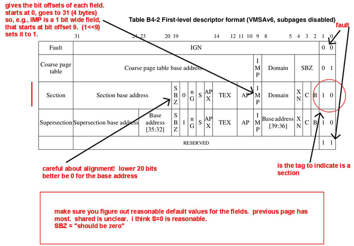

## Simple virtual memory with page tables.

  

----------------------------------------------------------------------
***NOTE:***
 - The test `.out` files were checked in without hashes of all
   the page table modifications.  This makes them pretty weak and easy to
   pass with mistakes that will bite you later.   I've checked in fixed
   versions in `code/tests-2.0`.  You'll have to add the following line
   defining `GREP_STR` in your `Makefile`  and change your tests to use
   `tests-2.0` vs `tests`.

        # add this line at the bottom of `Makefile`.
        GREP_STR := 'TRACE:\|HASH:\|ERROR:\|PANIC:\|SUCCESS:'
        include $(CS140E_2024_PATH)/libpi/mk/Makefile.robust
----------------------------------------------------------------------

Last lab we did a trivial virtual memory system without page tables by pinning
entries in the TLB.  This approach lets us map a reasonable amount of memory
(16MB * 8 = 128MB) without much complexity.  If you can get away with it,
I recommend this approach for embedded systems you build.  

However, for large systems this will be too limiting.  So today we do
page tables by writing the code for single-level page tables that use
1MB sections (as we used in the last lab).  This second run at VM with
a slightly different data structure hopefully helps the concepts sink
in more thoroughly.

Today you'll make page-table versions of the pinned routines you made
last time.  The tests in `code/tests` are slightly tweaked versions
of last lab that have been updated to use these new routines.
The code you write:
  - Today: `pt-vm.c`.  (Interface in `pt-vm.h`.)  The these routines
    just call staff versions at the moment.
  - Next VM lab: the assembly in `your-asm.S`.  These are the 
    routines that actually turn on/off/init the hardware MMU.

The rest of the files:
 - `mem-attr.h`: this is the memory attribute code from `pinned-vm.h`
   with the pinned code removed.   Confusingly we still call the 
   memory attribute structure `pin_t` but we only use it for
   memory cache attributes, protections etc.

 - `mmu.c`: these are C wrappers that do simple error checking and
   call the assembly routines in `your-asm.S`.  You should look
   at them but you don't have to modify them today.

 - `mmu-helpers.c`: these are the print routines we use.

Given that this is a simple extension of last lab, hopefully things
go relatively smoothly and you can get checked off on both.

You can view today's and next VM labs as fetchquests for how-do-I-do-X
where the goal is to implement everything yourself and delete our
implementations.    Today will be `staff-pt-vm.o` (see `pt-vm.c` for the
corresponding routines) and thursday will be `staff-mmu-asm.o`.

What you modify today:

   1. `armv6-vm.h`: you need to correctly use bitfields
      to control the layout of the `fld_t` first level descriptor
      structure.  The current definition will cause the static assertion
      to fail.  After your modifications the checks in `mmu-helpers.c` should
      pass.  (This file contains useful printing and checking routines.)

   2. `pt-vm.c`: this will hold your page table code that manipulates
      the 1-level, section-based, page table.  The staff file
      `staff-pt-vm.o` provides working versions you can call.

What you modify next time:

  - `arm-coprocessor-asm.h`: we don't use this header today, but will
    on thursday.  It has a fair number of instructions used to
    access the privileged state (typically using "co-processor 15").
    Sometimes the arm docs do not match the syntax expected by the GNU
    assembler.  You can usually figure out how to do the instruction
    by looking in this file for a related one so you can see how the
    operands are ordered.

  - `your-mmu-asm.o`: this has the low level assembly routines used to
    update machine state after changing page table mappings or switching
    address spaces.

What you shouldn't have to modify:

  - `mmu.h`: this has the data structures we will use today.   I've tried
    to comment and give some page numbers, but buyer beware.

  - `mmu-helpers.c`: these contain printing and sanity checking routines.

   - `docs/README.md` gives a rundown of where some key registers /
     machine state is defined.  In general, if the page numbers begin
     with a `b` they are from the armv6 general documents (the pdf's that
     begin with `armv6` such as `armv6.b2-memory.annot.pdf`) Without a
     letter prefix they come from the `arm1176*` pdf's.

#### Check-off

You need to show that:
  1. You remove the `staff-mmu.o` from `code/Makefile` and all the tests pass.
  2. You can handle protection and unallowed access faults (port your
     code from last time).
  3. Write two new tests that test new functionality.  E.g., 16MB sections.
     Do a real fork.  etc. 

----------------------------------------------------------------------
## Part 0: (fast) define the first_level_descriptor structure.

This is a bit basic, but it's good practice.  You'll need to finish the
`struct first_level_descriptor` in file `armv6-vm.h` based on the PTE
layout given on B4-27 (screenshot below):

  - We've defined fields for the section base address, `nG`, `S`,
    `APX`, `TEX`, `AP`, `IMP`, `Domain`, `XN`, `C`, `B`, and the tag.

  - You should look at the structure `struct control_reg1` given in
    `armv6-cp15.h` to see how to use bitfields in C.

Provided helper routines:

  - It is very easy to make mistakes.  If you look in `mmu-helpers.c`
    you can see how the `fld_check_offsets()` routine (modeled on
    `check_control_reg()` that uses the `check_bitfield` macro to verify
    that each field is at its correct bit offset, with its correct
    bit width.

  - There is a routine `vm_pte_print` to print all the fields in your
    structure.

  - HINT: the first field is at offset 0 and the `AssertNow` uses tricks
    to do a compile-time assert.

Testing:
  - `make check` of `PROGS := 0-test-structs.c` should pass.

----------------------------------------------------------------------
##### The PTE for 1MB sections document:
<table><tr><td>
  
</td></tr></table>

----------------------------------------------------------------------
## Part 1: work through the routines in `pt-vm.c` and test cases.

Go through and start implementing your own versions of the page table
routines.  Again these roughly mirror pinned code you did last time.
You'll write the code to fill in the page table assuming the use of
1MB sections.

You should do these one at a time (maybe doing one test at a time)
swapping your code for ours.

You can also just ignore our code.

The document you'll need for this part is:
  - The annotated B4 of the ARM manual `docs/armv6.b4-mmu.annot.pdf`,
    which describes the page table format(s), and how to setup/manage
    hardware state for page tables and the TLB.

When you finish you should be able to:
  - remove `staff-pt-vm.o` from `STAFF_OBJS` in the `Makefile`.
  - `make check` should pass as before.

### NOTE: we use `pin_t` to specify memory attributes.

To repeat the discussion above: for today we reuse the memory attribute
structure `pin_t` (defined in `vm-attr.h`) from last lab.

Even though it has the `pin_` prefix in its name, it is not specific to
pinning: we use it to define what caching policy, protections,
etc a given mapping needs.

We reuse the name and type so you don't have to figure out some other
way of specifying these attributes.  However, it is a little jarring to
see the `pin_` even though we aren't using pinning.

### Hints for implementing `vm_map_kernel`

For `vm_map_kernel` you'll want to look at the routine
`procmap.h:procmap_pin_on` in the last lab and just rewrite this routine
to switch from using pinned routines to our page tables versions.
You should also look at today's first test case `1-test-basic.c`
to see what has to be done to set things up.  Also look at test
`2-test-procmap.c` which uses `vm_map_kernel`.

The goal of `vm_map_kernel` is to wrap up all the code to do the initial
MMU initialization, and kernel memory mapping setup so that it can start
running with virtual memory.

  1. Compute the domains used in the procmap (same as in pinned).
  2. Initialize the mmu with these domains (same as in pinned, though
     different routine name).
  3. Allocate the page table.
  4. Setup all the mappings and check that they are in there (use `vm_lookup`)
     You can call the `attr_mk` routine right above `vm_map_kernel` to 
     compute the actual attributes for each type of memory page.
  6. Enable the mmu if `enable_p` is set.

### Hints for implementing `vm_map_sec`  (see `armv6-vm.h`)

You'll want to look at your pinned code, since it works about the same.

Useful pages:
  - B4-9: `S`, `R`, `AXP`, `AP` (given below).
  - B4-12: `C`, `B`, `TEX` (given below).
  - B4-25: `nG`, `ASID`, 'XN`.
  - B4-28: bit[18] (the IMP bit) `IMP = 0` for 1MB sections.
  - B4-10: Domain permissions.
  - B4-29: translation of a 1MB section.

The following screenshots are taken from the B4 section, but we inline
them for easy reference:

----------------------------------------------------------------------
##### The definitions for `S`, `R`, `AXP`, `AP`:
<table><tr><td>
  
</td></tr></table>

----------------------------------------------------------------------
##### The definitions for `TEX`, `C`, `B`:
<table><tr><td>
  
</td></tr></table>

----------------------------------------------------------------------
##### Description of `XN`, `XP`, etc.

<table><tr><td>
  
</td></tr></table>

----------------------------------------------------------------------
### Part: 2: handle a couple exceptions

Port your exception tests from last time and make sure they work.

----------------------------------------------------------------------
### Part 3: write some kind of functionality and a test.

Do either a couple simple things, or a bigger one.

Some simple examples:
 - Write a test that checks that you correctly resolve addresses with
   offsets.  So, that va == pa for identity mapped code no matter
   which offset you use (from 0 up to 1MB).
 - Implement 16Mb pages and show they work.
 - Setup a user mode process and make sure that it can't access
   kernel memory.
 - Make a stack that automatically grows (e.g., if you write beyond
   the stack pointer it grows the stack automatically).    As mentioned
   in the next point, 
   you should call `staff_mmu_sync_pte_mods()` after you modify 
   a page table entry.  (This invalidates caches it could be in or
   influence.)
 - Change memory protection (implement `vm_mprotect`), show it faults,
   and change back.  (Note: when you modify existing page table entries
   you will have to call `staff_mmu_sync_pte_mods` after you modify the
   page table.).

Some bigger ones:
 - Setup caching and show it makes some matrix operation better.
 - Implement 4k pages and show they work.
 - Write a real `vm_fork()` that can fork a page table while
   running in another address space.
 - Make threads that have their own page tables and thus private
   memory.
 - automatically grow the stack (below).

----------------------------------------------------------------------
### Extension: extend the equivalance checking (lab 14) to have vm.

Pretty straightforward idea: adapt the single stepping equivalance checker
from lab 14:
  - `equiv-threads.c` in the `code-patch-2` or `code-complete-staff`.

And use it to show that running with and without VM (where the VM uses
identity maps) gives the same hashes.  You can then do the fancier version
of showing you get the same hashes even if you switch between proceses.

You'll learn a ton doing this!  It's what I wanted the final lab to be.

----------------------------------------------------------------------
### Extension: Automatically grow the stack.

As before, to handle a write to an unmapped section:
  1. Use the "Data Fault Status Register" to get the cause (b4-19,
     b4-20, 
     b4-43,
     b4-44).  And the "Combined Data/FAR" to get the fault address
     (b4-44).  The instruction encodings might be a bit hard to figure
     out, so look in `arm-coprocessor-asm.h`).  You can do these as
     inline assembly (look in
     `cs140e-src/cycle-count.h` for an example); confusingly you'll have
     to use a capitalized opcode `MRC` or `MCR`).

  2. We are doing 1MB segments, so these will be a section violation (encoding
     on b4-20).

-----------------------------------------------------------------------
### Extensions

There's a ton of extensions to do:
  - do nested page tables with 4k pages.
  - port the tests from last time over with a consistent interface.
  - make code fast by changing the the page attributes and co-processor settings to 
    enable the datacache.

  

