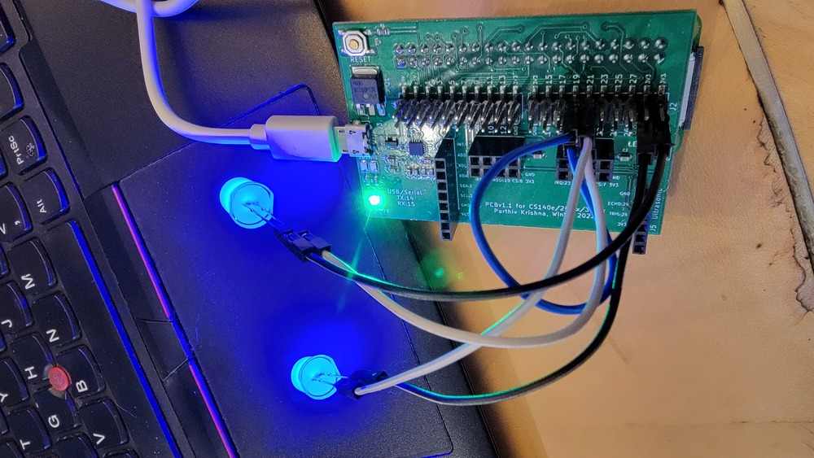
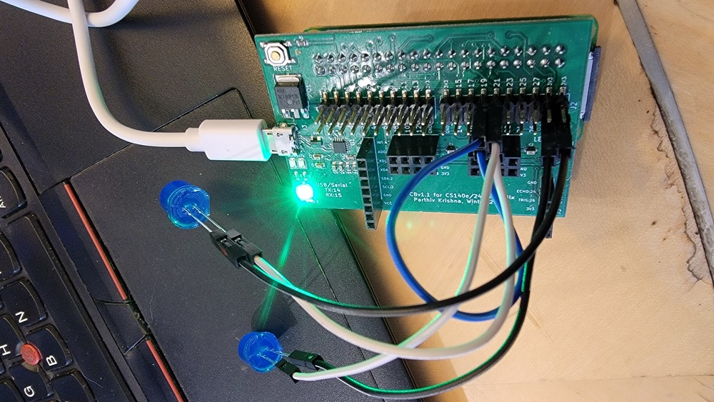

# Lab: write your own code to control the r/pi; throw ours out.

  

**Important: as always, read and complete the [PRELAB](PRELAB.md)
before lab!**

In this lab, you'll use the Broadcom document
(`../../docs/BCM2835-ARM-Peripherals.annot.PDF`) to figure out how to write the
code to turn the GPIO pins on/off yourself, as well as reading the pins to get
values produced by a digital device. You'll use this code to blink an LED and
to detect when a capacitive touch sensor is touched.

Make sure you read the [GPIO](GPIO.md) and [DEVICE](../../notes/devices/DEVICES.md)
notes.

Notes:
  - See [the setup lab](../0-pi-setup/README.md) for more info on how to
    set up your Raspberry Pi.
  - See the [checkoff doc](CHECKOFF.md) for info on what you need to
    show to get credit for the lab.
  - If you finish early, feel free to do the extensions (e.g., sonar)
    at the bottom of the README.

------------------------------------------------------------------------------
## 0. Make sure your LED + hardware works.

Before we mess with software that will control hardware, we first make
sure the hardware works:

  1. When doing something for the first time, you want break it down
     into small pieces so that if something goes wrong, isolating the
     cause is easier.

  2. Similarly, when we do anything with both hardware and software,
     you always want to test the hardware in isolation first, if at all
     possible.  If you don't, and things don't work, you'll immediately
     be wasting time because you don't know if the bug is in software
     problem or a hardware (or, worse, both).   Hardware can arrive
     broken (especially since we buy off-brand copies to save money)
     or, more common, just be hooked up incorrectly.

     In the best case, you can control the hardware solely by hooking it
     up and seeing that it does something (true today).  In addition, one
     cheat code for this class is that we will always give you pre-built
     binaries you can run to check the hardware.  (If you want to play
     on harder mode, just ignore these.)

So as our first step, we'll use the parthiv-pi 3.3v power and ground pin
to directly turn on an LED. This tests some basic hardware and that you
know how to wire.

Today this is pretty simple:
 - Use jumpers to connect your LED to ground and briefly touch the other
   jumper to 3V (not 5v!).

 - If the LED doesn't go on, reverse its connections. You'll note that
   one leg of the LED is longer than the other. This is used to indicate
   which one is for power, which is for ground. You can empirically
   determine which is which.

 - If still doesn't go on, plug someone else's working version into your
   your computer. If that doesn't work, ask.

   If it still doesn't go on, try with your other Pi and/or another
   LED. If that doesn't work, ask.

NOTE:
  1. The color of the wire does not matter for electricity, but
     it makes it *much* easier to keep track of what goes where: please use
     red for power, black for ground!
  2. EE folks: We don't use a breadboard b/c it's bulky.
     We don't use resistors for the same reason + the LED is big enough
     we generally don't fry it.

------------------------------------------------------------------------------
### Part 1: make GPIO output work 

Before starting:
  1. Hook up an LED to pin 20 and ground.
  2. Make sure your wiring works by running `staff-binaries/1-blink.bin`.  The
     LED should blink.
  3. Hook up another LED to pin 21 and ground.
  4. Make sure your wiring works by running `staff-binaries/2-blink.bin`.  The
     two LEDs should blink in opposite orders.

You'll implement the following routines in `code/gpio.c`:

1.  `gpio_set_output(pin)` which will set `pin` to an output pin. This should
    take only a few lines of code.
2.  `gpio_set_on(pin)` which will turn `pin` on. This should take one line of code.
3.  `gpio_set_off(pin)` which will turn `pin` off. This should take one line of code.

After implementing the routines, both `1-blink.bin` and `2-blink.bin`
should pass.  Note: if they don't, run the staff binary to make sure a
jumper didn't get disconnected.  Do all three checks below:

 1. `code/1-blink.bin`: power-cycle the pi (use the metal button on parthiv-pi)
     and use the bootloader to load the code:

          % pi-install 1-blink.bin
          # the LED on pin 20 should be blinking.

 2. `code/2-blink.bin`: power-cycle the pi (use the metal button on parthiv-pi)
     and use the bootloader to load the code:

           % pi-install 2-blink.bin
           # the LEDs on pin 20 and pin 21 should be in opposite orders.

    Success looks like (please ignore the fact that the in the photos doesn't
    use parthiv-pi):

  
  

 3. Finally: Make a copy of `1-blink.c` (make sure it works with the
    makefile) and change it so that it uses pins on two different
    banks. Make sure it works as expected! You could also do more than
    2 LEDs.

Hints: [hints doc](HINTS.md)

------------------------------------------------------------------------------
### Part 2: Make `gpio_input` work

Hardware check before writing code:
  1. Connect a jumper to pins 18 and 19.
  2. Make sure when you run `staff-binaries/3-blink.bin` that the two
     LEDs are on and off at the same time.

  
  

Part 1 you used GPIO for output, you'll extend your code to handle input
and use this to read input. At this point you have the tools to control
a surprising number of digital devices you can buy on eBay, adafruit,
sparkfun, alibaba, etc.

For this part you'll:

- Implement `gpio.c:gpio_set_input` and `gpio.c:gpio_read()`
- Use "loopback" jumper connected to 18 and 19 to control
  one of the leds.

More detail:

1.  Implement `gpio_set_input` --- it should just be a few lines of
    code, which will look very similar to `gpio_set_output`.

    Make sure you do not overwrite a previous configuration in `fsel`
    for other pins! You code will likely still work today, but later
    if you have multiple devices it will not.

2.  Implement `gpio_read` --- make sure it  only ever returns 0 or 1.
    Not some large positive integer when a pin is on.  Similarly, make
    sure it ignores the values for pins that aren't being checked.

3.  Run the code:

            % make
            % pi-install 3-loopback.bin

4.  Success: both LEDs will be on or off at the same time.

If this is your first time working with Raspberry Pis, you're almost done!
Check the [checkoff guide](./CHECKOFF.md) for what to show us.

If you took cs107e or you've done this kind of thing before, please do
an extension.

------------------------------------------------------------------------------
## Part 3: look through the code in `code` and `.list` file 

Other than the bootloader, all the code needed for this lab is in
`code`: there is no additional magic.  Please look through the code
and the `.list` files to see everything that is being used.  Note:
The code addresses come from `memmap` and correspond to the address in
`config.txt`.

------------------------------------------------------------------------------
## Extensions

If you finish early, and get tired of helping other people,
we encourage you to do the 
[first device extension, sonar](../extensions-device/1-sonar/README.md).

There are additional extensions in [the extensions doc](EXTENSIONS.md).

------------------------------------------------------------------------------
## Additional information

More links:

1. Useful baremetal information: (http://www.raspberrypi.org/forums/viewtopic.php?t=16851)

2. More baremetalpi: (https://github.com/brianwiddas/pi-baremetal)

3. And even more bare metal pi: (http://www.valvers.com/embedded-linux/raspberry-pi/step01-bare-metal-programming-in-cpt1)

4. Finally: it's worth running through all of dwelch's examples:
   (https://github.com/dwelch67/raspberrypi).

  

