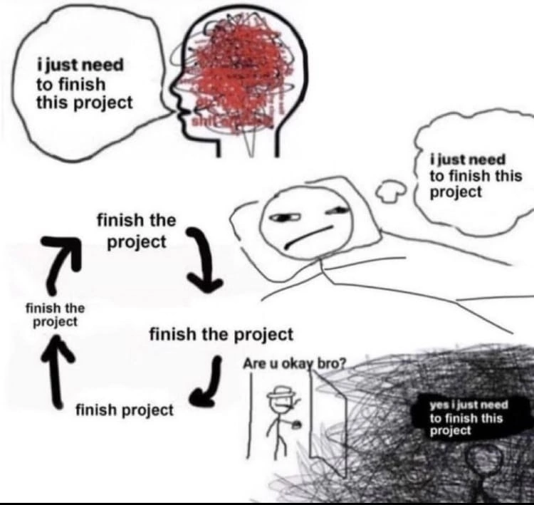
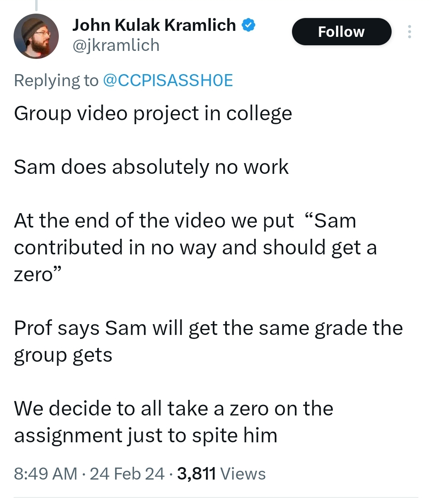

  

### Projects

In addition to the projects posted on Ed, some final project ideas are at
[projects](../projects/README.md).

Project logistics:
 - Should be about 3 labs worth of work.  More is also ok!
 - You can work with teams of up to 3 but more team members = more
   work required for same grade.
 - We can reimburse for equipment (within reason).
 - The final project presentations will be during the 140e final slot.
 - The presentation is optional.  There are 5 minute and 10 minute 
   slots depending on the project size. 

What to turn in:
 - You should write up a short description of your project (1 page is
   fine).  What the idea is, what the challenges were, what devices you
   did, any errata.
 - Ideally you make a video showing your project and have this on
   your github with a title + desciption so so we can point people in
   future classes to it.

   I think going over final projects on the first intro day of class is
   probably better than jumping into machine code (as we did this year).

***NEW: write up your devices as labs!***

  - It counts towards the overall project if for any device you have
    you write up a short device lab on how to get it working (and how
    to check its results) with the datasheet and maybe some starter code.

    Importantly: if another group successfully runs your lab and
    implements the device and gives feedback, this counts towards both
    groups final project grade.

  - If the lab is reasonable, we'll add it to the official repo with
    your name etc.  Ideally over the years we can build up 10s (100s?) of
    new device labs spun out from different final projects.

------------------------------------------------------------------------

  

